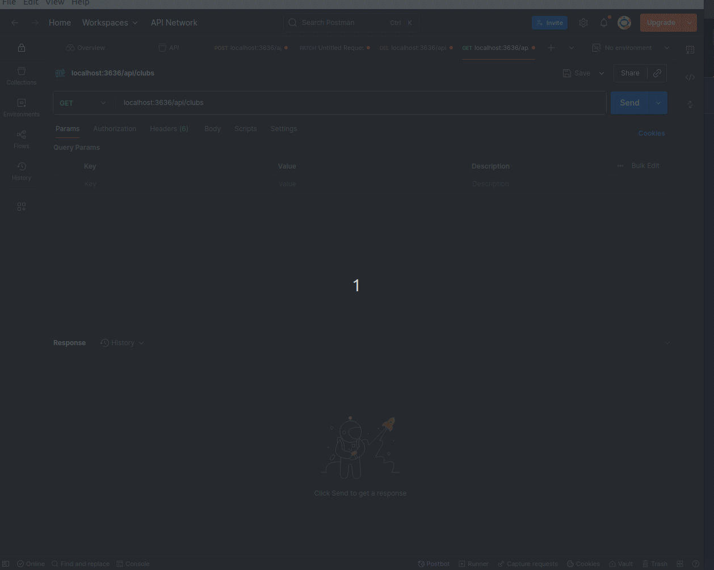

# ⚽ Player API - Backend de Gerenciamento de Jogadores e Clubes

Este projeto é uma API REST feita com **Node.js**, usando **Express**, para gerenciar jogadores de futebol e seus respectivos clubes. É ideal para consumir em um front-end (como React) ou servir como base para estudo de arquitetura de projetos em camadas.

---

## 📸 Visual do Projeto




---

## 🚀 Tecnologias Usadas

- Node.js
- Express
- TypeScript
- CORS
- JSON como "banco" (pode ser substituído por DB real futuramente)

---

## 📌 Endpoints Disponíveis

### 🎮 Players

| Método | Rota                   | Descrição                       |
|--------|------------------------|---------------------------------|
| GET    | `/api/players/:id`     | Retorna um jogador por ID       |
| GET    | `/api/players`         | Lista todos os jogadores        |
| POST   | `/api/players`         | Cria um novo jogador            |
| PATCH  | `/api/players/:id`     | Atualiza um jogador             |
| DELETE | `/api/players/:id`     | Remove um jogador               |

---

### 🏟️ Clubs

| Método | Rota               | Descrição                     |
|--------|--------------------|-------------------------------|
| GET    | `/api/clubs`       | Lista todos os clubes         |

---

## 🧪 Como Rodar o Projeto

```js
git clone https://github.com/dboravitoria/apiNodeChampionsLeague
cd apiNodeChampionsLeague
npm install
npm run start:dev
//Acesse a API em: http://localhost:3636/api
```
